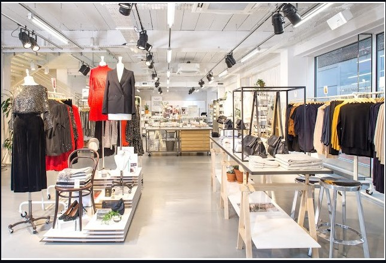

## Shopping-Revenue-Project

## Introduction

This is the data analysis focusing on the order of **shopping **Data.  
The marketing department aim to launch a campaign in the second quarter of 2024. However, they required a dashboard to monitor the business activity during the waiting period. I am excited to take-up this project to practice my skill of data cleaning, analysis and visualization.

Microsoft Excel Concept applied:
Customize Pivot table
Dashboard

## Problem Statement:

•	The sum of Total Sales

•	Total number of items Ordered

•	Total order by Color

•	Top 10 Order by Location

•	Order by Season

•	Peridical Order

•	Average review rate

•	Subscription Status

## Data Source:

The data was sent by my instructor into the class dataset folder, there I downloaded it and extracted it into Excel for cleaning, analysis and visualization.

o	It contains 337 sheets/tables

o	19 columns

o	3,911 rows

## Data Transformation / Cleaning

Data was efficiently cleaned and transformed with the Excel manipulation and management functions for better insightful. Some of the steps applied included:
1.	Removal of duplicate records
2.	Data sorting by sorting the records according to the customer’s order ID
3.	Data type formatting by setting the number of decimal places into 1decimal place
4.	Replacing of value by replacing the empty cell with appropriate value and also correction of spellings
5.	Rearrangement of the columns

## Visualization

The report comprises 3 sheets:
-   Shopping Data
-   Pivot table
-   Dashboard
  
You can interact with the report [here](shoppingdataproject.xlsx)

## Analysis

1.	The sum of total sales is $233,132
   
2.	The total items ordered is 3,901
   
3.	Total order by Color

  
   
4.     Top 10 Order by Location
    
  
  
5.  Order by Season
  
  
  
6.  Frequency of Order
  
  
  
7.  Average review rate

  
  

# Conclusion

Firstly, there were 3,901 customers who ordered from the store, of which males were the highest in number. this shows that the highest order the store had gotten over the months were from male customers.
Secondly,

